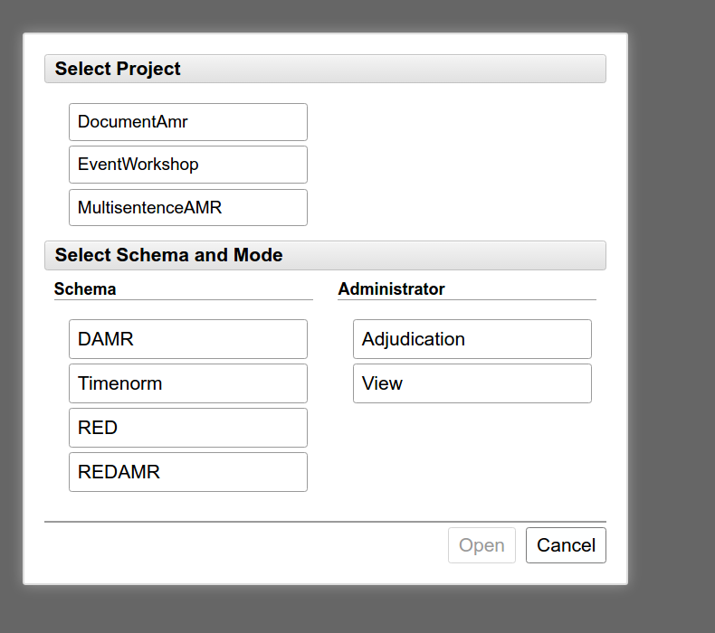
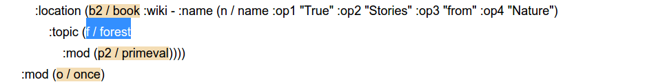
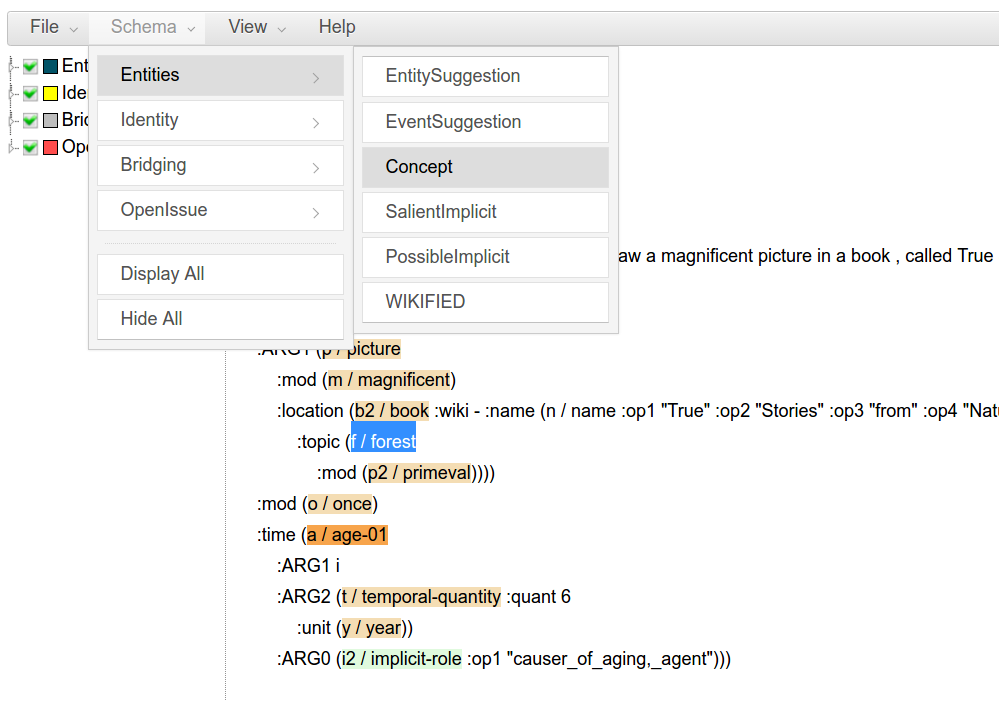

<!-- START doctoc generated TOC please keep comment here to allow auto update -->
<!-- DON'T EDIT THIS SECTION, INSTEAD RE-RUN doctoc TO UPDATE -->
**Table of Contents**  *generated with [DocToc](https://github.com/thlorenz/doctoc)*

- [Part I. Introduction](#part-i-introduction)
  - [The Core Task](#the-core-task)
  - [These are the same distinctions we make in normal AMR](#these-are-the-same-distinctions-we-make-in-normal-amr)
  - [Walking through some examples](#walking-through-some-examples)
  - [Starting with the Tool](#starting-with-the-Tool)
- [Part II: General Guidelines](#part-ii-general-guidelines)
  - [Making Identical Relations](#making-identical-relations)
  - [Making Set/member relations](#making-setmember-relations)
  - [Marking Part/Whole relations](#marking-partwhole-relations)
- [Part III: Details ](#part-iii-details)
  - [Discourse Phenomena](#discourse-phenomena)
    - [Anaphora referring to a mentioned event](#anaphora-referring-to-a-mentioned-event)
    - [Vague Discourse Demonstratives](#vague-discourse-demonstratives)
    - [Vague Discourse Reference with Implicit Arguments](#vague-discourse-reference-with-implicit-arguments)
  - [True generics (synonymous with "one","everyone") should not be linked to implicits](#true-generics-synonymous-with-oneeveryone-should-not-be-linked-to-implicits)
  - [Don't link up generics (that you wouldn't link in AMR)](#dont-link-up-generics-that-you-wouldnt-link-in-amr)
  - ["Redundant" relationships](#redundant-relationships)
    - [Redundant implicit arguments can be left out](#redundant-implicit-arguments-can-be-left-out)
  - [What Does a Variable Mean?](#what-does-a-variable-mean)
  - [How much can I consider modality?](#how-much-can-i-consider-modality)
- [Part IV: Guides for Common Situations](#part-iv-Guides-for-common-situations)
  - [Have-org-role-91 and Have-rel-role-91](#have-org-role-and-have-rel-role)
- [Part V: Handling Errors in the AMRs](#part-iv-handling-errors-in-the-amrs)
  - [AMR missed a within-sentence reentrancy](#amr-missed-a-within-sentence-reentrancy)
  - [AMR annotation has conflicting :wiki values for the same identity chain](#amr-annotation-has-conflicting-wiki-values-for-the-same-identity-chain)
  - [Removable components in equational clauses](#removable-components-in-equational-clauses)
  - [Decomposition Issues](#decomposition-issues)
  - [Missing Boxes](#accidentally-deleting-those-colored-boxes)

<!-- END doctoc generated TOC please keep comment here to allow auto update -->

Part I. Introduction
====================

You should already be familiar with our [AMR annotations](https://github.com/amrisi/amr-guidelines/blob/master/amr.md), which capture meaning within the sentence.  AMR captures a bunch of important within-sentence coreference decisions, but sticks to the sentence alone.  Here we will be trying to extend those policies for within-sentence coreference to the whole document, in order to build up a bigger, unified representation of the AMR document.


How AMR normally works:
-----------------------

Remember that AMR does all within-sentence coreference, regardless of why you know that information.  This means that sometimes in AMR, we are merging two explicit mentions into the same AMR variable.  Remember that "The boy wants the girl to believe him" is AMRed as follows, with the "boy" and "him" merged together into ```(b / boy)```:

```
(w / want-01
   :ARG0 (b / boy)
   :ARG1 (b2 / believe-01
             :ARG0 (g / girl)
             :ARG1 b))
```

As another example, consider the two different instances of "b" in the following sentence:

"The boy ran off to California and arrived on Tuesday" 
```
(a / and
      :op1 (r / run-off-24
            :ARG0 (b / boy)
            :ARG2 (s / state :wiki "California" :name (n / name :op1 "California")))
      :op2 (a2 / arrive-01
            :ARG1 b
            :ARG4 s
            :time (d3 / date-entity :weekday "Tuesday")))
```
In this example, AMR does not simply link explicit mentions, but also links things that are pragmatically inferrable, such as linking "ARG4" to "s".  If this sentence were to be split into two sentences, our normal within-sentence AMR annotations would lose some of the information that we had in the first example -- we would lose understanding of the boy's destination, because we weren't linking across sentences:

```
"The boy ran off to California."
(r2 / run-off-24
      :ARG0 (b3 / boy)
      :ARG2 (s / state :wiki "California" :name (n / name :op1 "California")))

"He arrived on Tuesday"       
(a3 / arrive-01
      :ARG1 (h / he)
      :time (d3 / date-entity :weekday "Tuesday"))      
```

We would also, of course, lose the explicit link between "boy" and "he", which we would also want to have. 

This annotation extends that annotation across sentence boundaries
------------------------------------------------------------------

You can view this annotation as simply *bringing that information back in*.  For explicitly mentioned arguments, that means linking together arguments like "boy" and "he" into "identity chains".  

For implicit information, that means adding links to that "implicit" role.  We do this by adding, to each AMR, the possible arguments that are not yet filled explicitly.  In this case, we know that "arrive-01" has four arguments, three of which are unfilled:

**arrive-01**
- **ARG1:** entity in motion / 'comer'
- **ARG2:** extent -- rare)
- **ARG3:** start point -- also rare)
- **ARG4:** end point, destination

This allows you to re-create what we were doing with "re-entrancies" in a normal AMR annotation; you can then link "state" in the first AMR to the implicit "**ARG4**" in the second AMR. 


Additional Kind of Links
------------------------

Finally, AMR will sometimes mark the relationships that hold between different objects when they are not identical, but related due to being members of a larger set or parts of a larger whole. For example, a single-sentence AMR for the following sentence might look as follows, with "include-91" capturing a set relationship showing that the individual cat "Mittens" is part of a set of 3 cats:
```
"John had three cats, one of which was named Mittens"
(h / have-03
      :ARG0 (p / person :name (n / name :op1 "John"))
      :ARG1 (c / cat :quant 3
            :ARG2-of (i2 / include-91
                  :ARG1 (c2 / cat :name (n2 / name :op1 "Mittens")))))
```

If we split this up into "John had three cats.  One cat was named Mittens", then suddenly we are missing that "include-91" relation, and the underlying Set/Member relationship between "three cats" and "one":

```
"John had three cats.  One cat named Mittens"
(h / have-03
      :ARG0 (p / person :name (n / name :op1 "John"))
      :ARG1 (c / cat :quant 3))

(c2 / cat :name (n2 / name :op1 "Mittens"))
```

The need for this kind of relationship gives us our third task: marking Whole/Part and Set/Member relations between concepts.  This gives us a richer understanding of the document itself. 


How this is done in ms-AMR annotation
-------------------------------------

To summarize the above, we are doing three things in this annotation:

- Linking coreferent variables across sentences 
- Putting implicit numbered arguments into those coreference chains
- Linking set/member and part/whole relations between variables


We will accomplish this by using a tool that works on top of the AMR annotations, Anafora. Because of the Anafora tool, each indexed concept with an AMR will have a little colored box, which we will add into coreference chains to do our annotations.  For example, the following AMR will be represented in Anafora as follows: 

```
They always need to have things explained . 
 (n / need-01 
	:ARG0  (t / they) 
	:ARG1  (e / explain-01    
	:time  (a / always)) 

``` 


You might notice that two arguments are actually added to the representation, "thing explained" and "explainer".  A pre-processing step during this annotation will ask our lexicon of predicates (from Propbank) for any numbered arguments unique to that predicate which have not yet been stated. These are added in blue to each AMR. 

When you want to link two of these variables, you simply press "u" (or access "IdentityChain" in the menu from Schema > Identity > IdentityChain), and then press "1" (or click on the empty box to the right of the word "Mentions" in the right-hand panel). This gets you into a coreference mode, where any AMR concept that you click on is added to a coreference chain.  For example, you can see the result of linking two mentions together in the following example; "g / grown-up" and "t / they" are now coded as identical:


The "implicit" boxes may be added to these chains just like any other concept.  

You may add relations such as Set/Member by going to the menu selecting it (such as  Schema > Bridging > SetMember).  Then you click on the empty box to the right of "SuperSet" in the right-hand panel, and click on the concept that is your superset.  After that, you click on the box to the right of "MemberOrSubset" and click on any number of members of that set:


Starting with the Tool
----------------------

You will need a username and password to access our annotation server.  Once you have that, go to verbs.colorado.edu/anafora-event . Once you've logged in, it should show you a screen such as the following:



Under Schema select "DAMR"; under "Mode" select "CoreferenceV2", and under "select project" pick ```MultisentenceAMR```. Within the "Training" corpus, you can then select a document to play around with. 


Part II: General Guidelines
===========================

:bangbang: *Remember the above guiding principles: we are trying to re-enact AMR coreference distinctions whenever possible.  Because there are many additional complexities, we will be including many additional guidelines and special cases, but remember to speak up if you feel that your annotations are deviating from within-sentence AMR behavior.*


Making Identical Relations
--------------------------

We are focusing on making "IdentityChain" links between all concepts that refer to the same thing, event, situation, or other concept.  We do not care what *type* of thing they are (or whether they have the same *concept* label within AMR).  Instead, we care about whether they  refer to the same thing, event or situation in the real world.  

These IdentityChain elements can contain all instances of an identity chain, and we want you to focus on getting ALL coreferent variables into the same chain.  That includes both all variables and all "implicit argument" concepts. 

In prototypical cases -- such as clearly anaphoric pronominal mentions, linking named entities, etc. -- this will be a clear case.  This will be more complicated when we get into implicit arguments, coreferent events, and other cases where its harder to concretely know "what is being referred to".  This document will contain a number of guidelines and edge cases, but we want you do remember that a fundamental guiding rule for this annotation is that we are trying to make this behave like normal, within-sentence AMR annotation. Because of that, follow the follow rule whenever your particular case is not handled in the guidelines:

**Universal Rule:** If in doubt, imagine that the sentences you are dealing with are all a giant run-on sentence.  Would you represent these using the same variable, using a re-entrancy?

A number of special cases to keep track of are listed below:


**Different "facets" of the same thing vs Subevent / Set-Member relations**

When we tell you to get things that "refer to" the same thing, there are two kinds of situations that seem "close" to being the same thing. One kind of thing is situations where the same thing is being referred to, but in completely different terms.  For example, two people with different political stances might be referring to the same  politician, but one might use their name, and one might call them a "devil".  Since they are referring to the same entity, the fact that they use different ways of framing does not matter; it should all be in the same identity chain.

Let's say you see the AMRs for "*Bill went to Trader Joes. The fool forgot to buy cookie butter.*"  There will be a "(f / fool)" and a "(p / person :name (n / name :op1 "Bill")).  While it's true that "(f / fool)" is going more than *merely* referring to Bill, it is nevertheless still referring to Bill, and thus should still be in the reference chain.  

This gets more tricky when we are dealing with events.  If we have a single event -- Obama signing a particular law -- then one AMR might refer to "Obama signed the law on the 22nd", and someone else might say "Obama signed away our freedoms on the 22nd". It's very important for us to know that these are actually referring to the same event!  So make sure that you annotate different framings of the same event as coreferent. 

This differs from instances of events where one mention of an event refers to a larger set of events.  In general, if you know that one event is a subevent of another event, **do not** link them into an identity chain.  If you are talking about one battle within a war, or one incision within an operation, or a particular discussion during a larger meeting, those are related by being what we call "Subevents".  It can sometimes be tempting to conflate these sometimes.  However, AMR instances do not, actually, merge these in AMR, and you should just leave them separate whenever possible.  Other, related annotation projects will actually annotate this "Subevent" data, so it will be cleaner for those projects if you don't consider such phenomena identical.

If what you are handling is actually and instance or a subset of a larger thing being referred to, don't conflate them into the same identity chain!  This will be particularly tricky with subsets, when you are talking about a group and get referents like "some of them...". Use Set/Member (which includes "set-subset" in its meaning) for such things.


**Do not mark "predicative" assertions about a mention**

It may be obvious that the AMRs for sentence such as "John is a fool", we want "fool" to be represented as a separate idea from "John".  Similarly, if we get a sentence such as the following, we do not conflate "f" and "h", as we would lose the entire meaning of what is being claimed:

```
Sally claimed that he was a fool
(c / claim-01
      :ARG0 (p / person :name (n / name :op1 "Sally"))
      :ARG1 (f / fool
            :domain (h / he)))
```

If you link "he" to an identity chain, *do not add "fool" to that chain*.  We already know what "fool" is in relation to John, as the ":domain" relation.  (This contrasts with examples in the above section, such as "the fool left early", where we may want to link "fool" to "John"). 

The same issue often comes up with titles and relational labels, such as those provided by "have-org-role-91":
```
The board nominated Sally to be the chair
```
This might get represented, ideally, as the following.  In such a case, you wouldn't want "chair" to be identical with Sally -- it's not a mention of "Sally", but a mention of the title/role given to Sally:
```
(n2 / nominate-01
      :ARG0 (b / board)
      :ARG1 (p2 / person :name (n3 / name :op1 "Sally"))
      :ARG2 (h2 / have-org-role-91
            :ARG0 p2
            :ARG1 b
            :ARG2 (c2 / chair)))
```
Furthermore, imagine you run into an AMR representing this more directly, such as the following.  For the same reasons noted above, do not link "chair" to Sally's identity chain: 
```
(n2 / nominate-01
      :ARG0 (b / board)
      :ARG1 (p2 / person :name (n3 / name :op1 "Sally"))
      :ARG2 (c2 / chair))
```

If multiple variables within the same AMR are linked together, we want you to imagine that AMR *as if all but one of those variables are replaced with re-entrancies.  That is to say, imagine you made the (bad annotation) of marking both "f/ fool" and "h / he" as being in the same identity chain below: 
```
Sally claimed that he was a fool
(c / claim-01
      :ARG0 (p / person :name (n / name :op1 "Sally"))
      :ARG1 (f / fool
            :domain (h / he)))
```

What you are saying is that they are *the same*, and that one should be replaced by a link to the other.  In this case, this would result in:
```
Sally claimed that he was a fool
(c / claim-01
      :ARG0 (p / person :name (n / name :op1 "Sally"))
      :ARG1 (f / fool
            :domain f))
```
Try to use this heuristic if you find yourself wondering whether to annotate multiple mentions in the same sentence.  Actually imagine forming the sentence so that one identity chain is just re-entrant variables of the other.  If that does not seem acceptable, the two variables should not be considered identical. 


**Wikified mentions are automatically linked to each other**

Your annotations should start with links between all wikified versions of the same entity.  You want to start with those wikified identity chains (color coded in maroon, for easy identification) and to link them to the rest of your annotations.  

**Do not blindly trust the preannotations**

These documents may be pre-annotated with information from other annotation sources (often, coreference annotations over the same data).  While this information will often be correct, you do not need to blindly trust it.  In particular, for instances where a "span based" annotation was simply a relational noun or organizational role, such as "brother" or "president", the pre-annotations may accidentally link to those titles rather than to the person in question 


**An "Identical" chain can't only have implicit mentions -- you need at least one non-implicit concept**

You will run into instances where multiple implicit arguments clearly co-refer, but where there is no clear mention of who they refer to.  Do not go through and annotate these unless you have at least one non-implicit variable that is part of that chain.  


**Don't link implict mentions to very broad general mentions**
--------------------------------------------------------------
AMR annotations are full of concepts such as "recommend-01" (used for modal verbs like "should"), where the recommender isn't really clear, but might construed as being "people in  general recommend that...".  "John is funny" can be constued as "People find John funny".    It might be tempting, therefore, if you find a nice generic like "people" or "one" or "everyone", to link up all these implicit arguments to such as generic.  **Resist that urge!**.  Since that is a can of worms, consider it to be explicitly forbidden to link to such terms.


**Don't link to implicit arguments of "grammatical" concets**
-------------------------------------------------------------
In AMR, we use terms like "recommend-01" and "contrast-01" to refer to very grammaticalized meanings introduced by discourse connectives and modal verbs.  Currently the tool may prompt you with rare arguments that only show up in the more explicit verbal forms -- so that when you see "but he should leave", the contrast-01 verb may provide an implicit "person making the contrast" or the "recommend-01" may provide arguments for who is being recommended to.   Normal within-sentence AMR annotator does not link to these arguments even when a candidate is available in the sentence, and we will therefore continue to not make that link across sentences.


Making Set/member relations
---------------------------

We define "Set/Member" as being roughly the same thing as "include-91"; a situation in which the larger superset is a cluster of instances, and in which the small referent is either a subset or a member of that set.  

**Don't mark Set/member between Identity Chains already linked by "Include-91"**

Set/Member is the same as include-91, and shouldn't be marked redundantly. 

**Set/Member should follow the same rules as "include-91", and is used for both "set/member" and "set/subset" phenomena**

As mentioned above, you can link to *subsets* of a larger set, where it is not a single instance of the larger set, but many.

**Set and Member should be roughly the same kind of thing**

This is part of the definition -- you should be able say "<MemberOrSubset> is one of <Set>" or "<MemberOrSubset> are just some of <Set>".  A particular exception to this are collective reference to groups -- juries, populaces, etc. -- that have individual members.  Even though a given person is not an individual instance of 'populace', you can naturally treat 'populace' as a set.

Naturally, "same type of concept" should be based on your own general understandin of what is being talked about.  The literal "concept" that a variable refers to naturally can be different. 

**Do not mark Set/Member with "extremely generic" mentions such as "one", "everybody", "everything", etc.**

You will run into things that, on some technical understanding of meaning, might be sets that contain some large percentage of things mentioned in the document.  This does not mean they should be linked together.  


**Do not mark Set/Member between wikified entities**

We assume that such relationships are identifiable from a database, and you should not worry about capturing them.  

**You don't need to show that (a / and) is Set/Member with its :opX instances**

There are many times in AMR where one mentions things like "John and Mary to the store" or "China and Japan are competing".  You can assume that "and" loosely encodes a set/member relationship; you don't need to add "set/member" to all of our coordination instances, nor to add it between "they" and "John" in "John and Mary went to the store.  They bought a cat."

**Marking "Sloppy anaphora" relations as member-member relations**

You might be tempted to look at the following kinds of sentences and assume that "do so" or "one" are identical with prior reference.  But are they?:

"Bill asked to be allowed to take the day off.  You should do that too."

"Bill got a new Hyundai. Jane might get one too". 

These are referred to in semantics under a variety of names such as "sloppy" or "same-type" anaphora.  In essence, while these *refer back* to a prior mention, they do not refer to the exact thing being referenced in the prior sentence.  In the first case, the asking event is the one in which Bill is the agent, and in which he is requesting that Bill be allowed to take the day off.  "Do that" postulates a new event with slightly different participants.  We therefore cannot call them the same event. 

Similarly, the new Hyundai that Bill received can only refer to "one" if Jane may buy Bill's Hyundai; otherwise "one" means "another instance of the same type".  

In order to handle these, we can use a tool you already have -- the "Set/Member" relationship.  Unlike other instances of set/member annotation, however, you do not have explicit mention of the "set" itself.  Instead, si	mply mark each item as a separate member, without an explicit set. 

This kind of situation -- particularly with "do" anaphora or "one" -- should be the ONLY situation where you do not have "SuperSet" entry; do not speculate about other situations in which a member-member link might be added.


Marking Part/Whole relations
----------------------------

Two entities exist in a WHOLE/PART relationship if one can be thought of as part of the other, larger composite entity. 

**Don't mark Part/Whole if any mentions are already linked with a :part-of relation**

Like Set/member and "include-91", this is the same as "have-part-91", so don't be redundant. 

**Part/Whole is about physical compositionality -- don't confuse it with "subevent" phenomena**

We are treating this entirely as being "X is a component part of Y".  Even though you might be able to say things like "this dance is part of the wedding" or "that incision was part of the surgery", you should **not** consider them part/whole for our purposes.  

**Part/Whole should not be used for organizational membership**

If someone is part of an organization, then the way to encode that is to link them together with implicit arguments on an instance of "have-org-role-91".  Part/Whole should only be used in the organizational senses when discussing company-company relations, like "Google is part of Alphabet". 

**Note that WHOLE/PART relationships are essentially hierarchical**

These may theoretically have a whole chain of relationships (a hair is part of a dog, a dog is part of a pack, etc.).  If one sentence mentions "I hurt my left hand" and another sentence mentions "More specifically, my thumb hurts", you want to be able to capture that hierarchical structure -- that the thumb is part of the left hand, and that the left hand is part of the person. 


**Do not mark Part/Whole between wikified entities**

We do not want to be annotating information that should be coming out of a database.  Debating whether "barcelona" is part of "spain" is a bit of a waste of annotator time, because we already should have that kind of information in a database.  However, if you see something like "the area", we may indeed want to identify a part/whole link if it's relevant.  

**Part/Whole is not for temporary or irrelevant spatial inclusion**

The particular building your are sitting in might be, in some technical level, a part of your city, of your state, your nation, and the world. But for the most part, AMR has not added inferential annotations for this kind of link, and so we will not be marking those links. Use part/whole only when the individual components truly do amount to parts of a whole -- a building might make up a university campus in a way that justified "part/whole" relation, for example, but doesn't deserve the same part/whole relationship to "the united states" or "the milky way".

One of the tests for this that is expressive of the kind of annotations we want for AMR, is whether the part/whole relation is necessary for understanding what is being referred to (or could be).  If you say "the buildings" and someone asks "which buildings?" and you can answer "the buildings on campus", then you might want to mark the part/whole relationship between buildings and campus. 

**Part/Whole is most necessary when this compositional part/whole information is needed for reference**

The kinds of Part/whole relationships that we definitely want to make sure we catch are the ones that help a document make sense.  By this we mean that if we have something like the following, "d" in the second sentence is not just any instance of a door, but a specific door -- the door of the car.  These are the kinds of part/whole relations that we want to not miss.  
```
John raced to his car.
(r / race-01
      :ARG0 (p / person :name (n / name :op1 "John"))
      :ARG2 (c / car
            :poss p))

He opened the door
(o / open-01
      :ARG0 (h / he)
      :ARG1 (d / door))
```


Instances of "Generic" wiki links
---------------------------------

Sometimes our "wiki" links will point to things that are not actually unique entities in the world, but are whole classes of things.  The most common of these will be product mentions such as "iPod", where mention of "my iPod" should not refer to owning the whole class of iPod products, but simply owning a single instance of an iPod.  In other words; if you have a discussion of people's different iPods, you may have many different identity chains, all of which have the same link to "iPod". 

These will therefore be preannotated incorrectly, based on this assumption that :wiki links also imply coreference.  in such as Case, delete those general identity chains and replace them with an "InstanceOfGenericWiki" link, available from Schema > Identity in the menu. 

Part III: Details 
================


Discourse Phenomena
-------------------

### Anaphoric Demonstratives and Discourse Anaphora, referring to a mentioned event(s)


In a given document, you might run into phases like "I didn't want to do that" or "that was fun", in which words and phrases like "do so", "that", "do that", etc. will refer back to prior events in context. 

Sometimes these are easy.  If they refer to a real event, that event has a single clear variable, you should just mark it as coreferent using "IdentityChain". For example:
```
Bob threatened to leave
(t / threaten-01
      :ARG0 (p / person :name (n / name :op1 "Bob"))
      :ARG1 (l / leave-11
            :ARG0 p))
```

```
Then he actually did so
(d / do-02
      :ARG0 (h / he)
      :ARG1 (s / so)
      :mod (a / actual))
```
In this case we would link "d" in this AMR to "l" in the prior AMR.  


**Which part of a "do that" or "do so" phases is the 'event'?**

There are a whole range of ways that this might be "referred to", and those might have different AMR treatments.  Which variable to you link to in the following AMRs? 
```
Then he actually did so
(d / do-02
      :ARG0 (h / he)
      :ARG1 (s / so)
      :mod (a / actual))
```

```
Then he actually did that
(d / do-02
      :ARG0 (h / he)
      :ARG1 (s / so)
      :mod (a / actual))
```

```
Did it actually happen?
(i / it :mode interrogative
      :mod (a / actual))
```

```
Did it actually happen?
(e / event  :mode interrogative
      :mod (a / actual))
```

For phases with a demonstrative like "this" or "that", or with "it", such as  "do that" , "that happened", "do it" , etc., use the demonstrative or pronoun ('that' or 'it'):
```
"If they that..."
(d / do-02
     :ARG0 (t / they)
     :ARG1 (t2 / that)
  ....)
```

For phases with a support verb like "do-02" and "so", use the predicate "do" rather than pointing to the "so":
```
"If they that..."
(d / do-02
     :ARG0 (t / they)
     :ARG1 (s / so)
  ....)
```

**What if there isn't a single clear antecedent?**

Often, something like "that" or "do so" does not refer to a single sentence, but extends across a whole range of the discourse.  A simplistic example might encompass a number of separate events:

```
"He stole money from people."
(s / steal-01
      :ARG0 (h / he)
      :ARG1 (m / money)
      :ARG2 (p / person))

"He tried to blame it on Bill"
(t / try-01
      :ARG0 (h / he)
      :ARG1 (b / blame-01
            :ARG0 h
            :ARG1 (p / person :name (n / name :op1 "Bill"))
            :ARG2 (i2 / it)))

"That's what I don't like"
(t / that
      :ARG2-of (l / like-01 :polarity -
            :ARG1 (i / i)))
```

**IF** it is viable to capture the set of variables that the "that" is referring to, we want to do so.  We make a "Set/Member" link, and treat "that" or "do so" as the superset, and treat the actual things that define that term as the members of the set.  In this case, the members would be "steal-01" and "try-01".  

However, sometimes it will **not** be easy for you to link to these.  For the same of consistency, a valid set of prior discourse units must pass these tests:
- It must be a contiguous set of prior sentences
- It must be the top variables of each AMR
- it should not encompass more than five prior AMRs. 

We acknowledge that these may seem arbitrary, but we want to avoid letting you annotate huge spans of prior discourse. 

**What if there is a discourse context with an implicit argument?**

Consider a sentence like:
```
But we left early
(c / contrast-01
      :ARG2 (l / leave-11
            :ARG0 (w / we)
            :time (e / early)))
```
This will show up in the Anafora tool as having an argument for the "ARG1" of contrast :

```
But we left early
(c / contrast-01
      :ARG1 (i / implicit-- first_item_in_comparison)
      :ARG2 (l / leave-11
            :ARG0 (w / we)
            :time (e / early)))
```

In such a case, you **can** feel free to make a Set/Member or IdentityChain relationship referring to other mentions, assuming it passses the rules mentioned above. 


Don't link up generics (that you wouldn't link in AMR)
------------------------------------------------------

As a clear-cut example, look at the AMR for the following sentence, and note that we have two different monetary amounts, each in a unit of "dollar". Indeed, both mentions of dollar are referring to teh same thing -- the general idea of US dollars.  But we nevertheless don't corefer them -- it would be wrong to replace "d2 / dollar" with a mere re-entrant variable "d3":

```
The government 's borrowing authority dropped at midnight Tuesday to $ 2.80 trillion from $ 2.87 trillion .

 (d4 / drop-01 
	:ARG1  (t / thing 
		:ARG1-of  (b / borrow-01 
			:ARG0 g 
			:ARG1-of  (a / authorize-01 
				:ARG2  (g / government-organization 
					:ARG0-of  (g2 / govern-01))))) 
	:ARG3  (m2 / monetary-quantity 
		:quant 2870000000000 
		:unit  (d3 / dollar)) 
	:ARG4  (m / monetary-quantity 
		:quant 2800000000000 
		:unit  (d2 / dollar)) 
	:time  (d / date-entity 
		:time "0 
		:weekday  (w / wednesday))) 
```

We do not link these "dollar" elements.  While technically you might say that they are talking about the same generalized idea of dollars, nothing is added by linking them together. Another way to say this is that, since "dollar" is a generic word without need of context, coreference of "d3" and "d2" adds no information to our AMRs. 

As a general rule, you can avoid coreferring things that are "generic", but you shouldn't be too strict about any exact definition of genericity; start with that definition and then try to calibrate to how this has been annotated in within-sentence AMR.  A good example of things that we are keeping slip are the two mentions of "economy" in the following AMR, used in "economic block" and "economic war":


```
I would suggest an economic block and the sharing of nuclear technology within this block to ensure their sovereignty from both military and economic war.
 (s / suggest-01 
	:ARG0  (i / i) 
	:ARG1  (a / and 
		:op1  (b / block 
			:mod  (e2 / economy)) 
		:op2  (s2 / share-01 
			:ARG0 b 
			:ARG1  (t / technology 
				:mod  (n / nucleus)))) 
	:purpose  (e / ensure-01 
		:ARG0 b 
		:ARG1  (s3 / sovereignty 
			:topic  (a2 / and 
				:op1  (w / war-01 
					:mod  (m / military) 
					:mod  (e3 / economy)) 
				:op2  (w2 / war-01) 
				:mod  (b2 / both)) 
			:poss b))) 
```

Or the two mentions of "politics" in the following:


```
There are far more important political and economical reasons for military intervention or political sanctions.
 (r / reason 
	:mod  (p / politics) 
	:mod  (e / economy) 
	:mod  (i / important 
		:degree  (m / more 
			:degree  (f / far))) 
	:ARG0-of  (c / cause-01 
		:ARG1  (o / or 
			:op1  (i2 / intervene-01 
				:ARG0  (m2 / military)) 
			:op2  (s / sanction-02 
				:ARG2  (p2 / politics))))) 
```


"Redundant" relationships
-------------------------

### Redundant implicit arguments can be left out

Imagine that the output of this annotation is a giant graph, where each entity like "Barack Obama" is a node, and each event is alow a node. If there's a document about Obama travelling to Vietnam, the event of him visiting Vietman might be a node as well, with a "travel-01" label and a "go-01" label.  In that graph, the event and "Barack Obama" might be together with all semantic roles we've seen, such as "arg0 of travel-01" and "arg1 of go-01".

In that context, if we see another mention of "travel-01", and we link that "travel-01" event to the same event we've been talking about already, adding a link between "Barack Obama" and the implicit agent of "travel-01" might not add any information at all, because we already knnow that that particular entity has a "arg0 of travel-01" relationship to that event.  In that particular instance -- where there is an implicit argument that is completely uninformative and redundant -- we don't need to add that relationship in. 

However, this ONLY applies when we have already seen that exact predicate sense before.  Even if we add a new mention to this same event of traveling to Vietnam, but if we use a new event like "visit-01", we don't know which argument of "visit-01" that he is participating in.

In other words, if we have one part of a document in which one mentions:
```
"the cat was bitten by the dog"
(b / bite-01 
      :ARG0 (d / dog)
      :ARG1 (c / cat))
```
Consider a mention that later says:
```
"They were worried about the bite"
(w / worry-01
      :ARG0 (b / bite-01)
      :ARG1 (t / they))
```
This will show in our multi-sentence AMR Anafora annotations as:
```
"They were worried about the bite"
(w / worry-01
      :ARG0 (b / bite-01 
           :ARG0 (i / implicit-biter_agent)
           :ARG1 (i2 / implicit-entity_bitten))
      :ARG1 (t / they))
```      
If you have linked "bite-01" to the first "bite-01", we don't need to also add in this redudant information for the  ```:ARG0 (i / implicit-biter_agent)``` and ```:ARG1 (i2 / implicit-entity_bitten)```.  


What Does a Variable Mean?
--------------------------

Whenever possible, we want identity chains to be strict about questions like "modality" and "polarity"  -- claims about whether an entity or event is real, hypothetical, or is referring to some general class of things.   However, sometimes it might not be entirely clear what the real interpretation of a variable is.  For example, consider the "a2" in the following AMR:

```
We insist that you adhere to the contract or else we will sue you.
(a / and 
      :op1 (i / insist-01 
            :ARG0 (w / we) 
            :ARG1 (a2 / adhere-02 
                  :ARG0 (y / you) 
                  :ARG1 (c / contract))) 
      :op2 (s / sue-02 
            :ARG0 w 
            :ARG1 y 
            :condition (h / have-polarity-91 
                  :ARG1 a2 
                  :ARG2 -))) 
```

When in doubt, try to interpret AMRs as if a variable like "a2" is defined by its concept ("adhere-02") and all of the arguments that are under it in the AMR (the ```:arg0 (y / you)``` and ```:arg1 ( c / contract)```), and try to decide on an interpretation of that AMR variable that makes the most sense in context.  In this case, you might interpret that as something like "the idea of you adhering to the contract" -- it being both the thing that's insisted upon, and the thing that, if not true, would cause a lawsuit.  

To give you another example for how to interpret a particular referent, consider something like "c" in the below AMR, simply referring to "social conservatives": because the polarity is not within the term
```
Not social conservatives.
(h / have-polarity-91 
      :ARG1 (c / conservative 
            :mod (s / social)) 
      :ARG2 -) 
```

In contrast, "s", having a ```:polarity -``` within the brackets of "s", can be assumed to inherently mean "racially insensitive":
```
Racially insensitive?

(s / sensitive-03 :polarity - :mode interrogative 
      :ARG1 (r / race)) 
```

Be strict about identity -- if you are sure that one variable really refers to an event, and another variable in another sentence refers to the negation or that event, don't refer them together!  

:bangbang: That does not mean that all coreferent mentions need to agree on polarity.  If one sentence says "John forbade is children from eating cookies" and another talked about how "he didn't allow his children to eat cookie", you are completely allowed to link the "f" meaning "forbid" and the "a" meaning "allow-01 :polarity -" together into the same identity chain.  


How much can I consider modality?
---------------------------------

AMR annotation is not always consistent about coreference; sometimes different "versions" of a term will all be linked together under the same variable, and have different kinds of modality.   For example, consider the "a2" in the following AMR:
```
We insist that you adhere to the contract or else we will sue you.
(a / and 
      :op1 (i / insist-01 
            :ARG0 (w / we) 
            :ARG1 (a2 / adhere-02 
                  :ARG0 (y / you) 
                  :ARG1 (c / contract))) 
      :op2 (s / sue-02 
            :ARG0 w 
            :ARG1 y 
            :condition (h / have-polarity-91 
                  :ARG1 a2 
                  :ARG2 -))) 
```
Is the "being insisted" part of the adherence?  What about the "have-polarity-91"?

We will assume that a given variable like "a2" refers to *itself and every thing and relationship "under" it in the AMR tree*.  In this context, "a2" therefore refers to an event of adhering, given that "you" is the one following the rules and the "contract" is the set of rules followed.  Other relations -- like the "if you don't....", don't necessarily need to define *what it is* that these variables are.

To give you an example for more 'thing-like' variables, we are just assuming that "c" in the below AMR simply refers to "social conservatives": because the polarity is not within the term
```
Not social conservatives.
(h / have-polarity-91 
      :ARG1 (c / conservative 
            :mod (s / social)) 
      :ARG2 -) 
```

In contrast, "s", having a ```:polarity -``` within the brackets of "s", can be assumed to inherently mean "racially insensitive":
```
Racially insensitive?

(s / sensitive-03 :polarity - :mode interrogative 
      :ARG1 (r / race)) 
```

:bangbang: Sometimes the AMR you've been given won't quite give you the variable or structure that you want -- you might want to link to a positive version of something, for example, but only have a negated version.  If two variables, under these underpretive rules, don't refer to the same thing, then don't mark them as coreferential. 

Part IV: Guides for Common Situations
=====================================


Have-Org-Role and Have-rel-role
-------------------------------

One of the most common classes of border cases comes from organizational relationships and interpersonal relationships, encoded in AMR with the ```have-org-role-91``` and ```have-rel-role-91``` predicates.  Since we use these to encode most titles and other relationships, the same entity will often have many instances of ```have-org-role-91``` or ```have-rel-role-91```, all expressing very redundant information.

Since these are so common, it's useful to remember a general rule: ***you should almost never link instances of have-org-role-91, have-rel-role-91, or the titles (`:arg2`) that they use.***.  This is a special case of our larger interest in [not encoding redundant information](#Redundant-relationships). 

Another way to say this is that if two instances of ```have-org-role-91``` or ```have-rel-role-91``` are not in conflict, one can assume that they don't need to be explicitly linked.  This leads to the exception to that generalization: only worry about have-org-role-91 and have-rel-role-91 if there are different characterizations of the same relationship (usually: different ```:arg2``` roles).  If one sentence refers to Obama with the title of "Commander in Chief" and another with the title "president", then linking those two predicates with an identity relationship is needed.  ***Otherwise, it is not needed.***

Because of the above rules, the one common situation in which you will end up doing coreference annotation regarding ```have-org-role-91``` will be when a relationship is encoded both as a ```have-org-role-91``` relation in some sentences, and as a separate explicit predicate in others.  Predicates such as ```lead-02``` and ```manage-01``` can (and often should) be linked to their corresponding ```have-org-role-91``` relationships.  

Part V: Handling Errors in the AMRs
====================================

There are a bunch of issues that you might encounter that are essentially caused by issues in the original AMR annotation.  

Adding an "OpenIssues" link
---------------------------

If -- and only if -- an annotation error issue is so egregious that you are having trouble annotating the sentence, you can add an "OpenIssue" relation.  This has two fields for referring to concepts ("Thing1" and "Thing2") and a Problem field wherein you can type in the text.  

You can try to annotate *as if* someone is going in and fixing this issue. We will try to go into the actual AMRs and fix these issues directly based on your note.  However, be extremely sparing about these notes; we don't want you to label every single error you run into, but simply every one that seems to completely stop you from correctly annotating the identity phenomena. 


Correcting a "wiki" relation
----------------------------

Occasionally, a ":wiki" link will be simply wrong.  If this is a minor issue, you can ignore it, but sometimes this will cause dramatic issues or errors in the data.  For this case, we have a ```Wiki``` relation, which you can see in the Schema >> Identity >> Wiki relation.  For this situation, find the correct wikipedia link (by going to www.wikipedia.org and finding the correct wiki link ID) and add that to the "wiki" field, and add all members of that chain to the "members" link. 

AMR missed a within-sentence reentrancy
---------------------------------------
You **are** allowed to link within the same sentence, but only in the case of errors, where you believe the original AMR should have merged those into a single variable. Simply treat them like normal mentions, and link them to your identity chain normally. 

AMR annotation has conflicting :wiki values for the same identity chain
-----------------------------------------------------------------------
If you run into this situation, annotate an identity chain as normal, but make sure that every instance of this term is brought into the same identity chain. During quality control we will check for whether a given chain has multiple :wiki links; all you need to do is catch the error. 

Removable components in equational clauses
------------------------------------------

Remember that in the AMR guidelines, "the boy is a hard worker" is AMRed as:

```
(w / work-01
      :ARG0 (b / boy)
      :manner (h / hard-02))
```

You may run into cases where this kind of thing is instead annotated as 

```
"the boy is a hard worker"
(p / person
      :ARG0-of (w / work-01
            :manner (h / hard-02))
      :domain (b / boy))
```

In this case - instances where two terms are related by a ```:mod``` or ```:domain```, but should have been AMRed as having a single concept instead -- you may annotate BOTH mentions as coreferential; we will go through and fix the issue. Only do so if you are absolutely sure that is an AMR annotation error, however; otherwise link simply to the term that is treated as less predicative (as in "the boy" in the above example).   


Decomposition Issues
--------------------

You'll notice that a word like "drawing" might sometimes be AMRed as:
```(t / thing :ARG1-of (d / draw-01))```

You might see it sometimes done as:
```(d / drawing)```

or even as:
```(d / draw-01)```

In these cases, we are essentially dealing with two, intertwined reference types -- the result of a drawing event, and the act of drawing.  If at all possible, you should simply assume that these are two separate identity chains, and try to assign each mention to one chain or the other. 


Accidentally Deleting Those Colored Boxes
-----------------------------------------

All multi-sentence amr nodes are already labeled with the colored boxes showing the variables -- with various irrelevant names like "concept", "eventsuggestion", "entitysuggestion", and so forth.  It is possible to delete these.  You never want to do that, but if you accidentally do delete one, don't worry! You can just re-create another entity node in its place -- it won't affect our scripts.  

 So let's say that we have accidentally removed the box for "f / forest" in the training document:


To fix it, you first need highlight the text where that box would be.    Start right before the variable (the letters and numbers before the "/", in this case "f") and highlight the whole word after the "/" ("forest")	, like the following:



Once that is highlighted, you want to create a "Concept" node. Go to the Schema menu, go to "Entities", and select "Concept", as follows:



That's it!  Your document should behave normally, and you can treat it like any other variable.  Don't worry if the color of the box is different from what is was before -- those colors are just for your own use anyways.  
